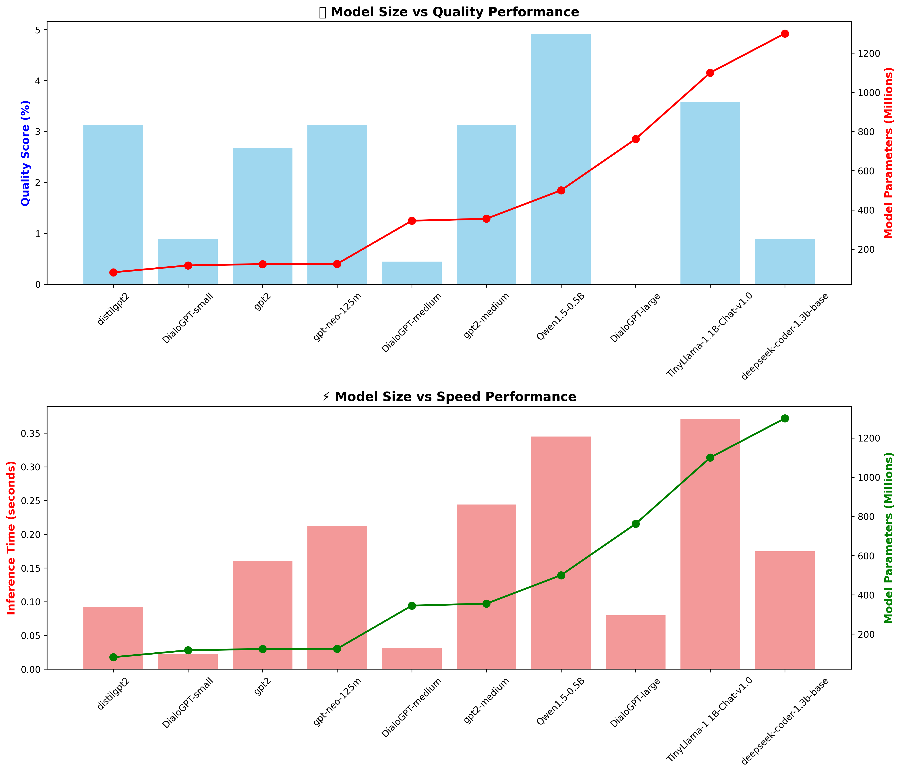
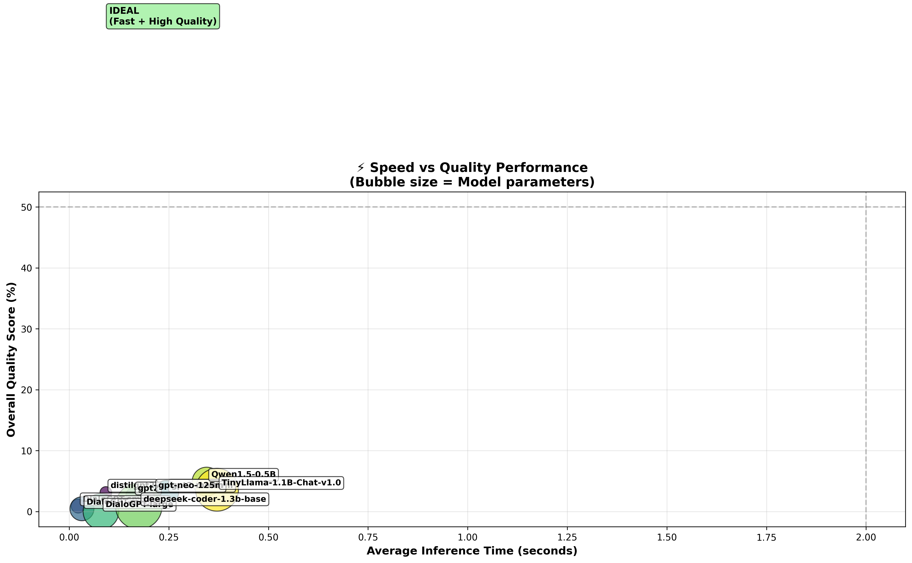

# NLP Fraud/Scam Detection Baseline Models

[](https://github.com/RockENZO/NLP-Cyber-Harm-Detection.git)

A comprehensive implementation for fraud and scam detection using advanced Natural Language Processing techniques. This project leverages state-of-the-art transformer-based models for accurate fraud classification with **explainable AI-powered reasoning**. The latest **BART Joint Model** provides simultaneous classification and detailed contextual explanations in a single unified architecture.

## 📁 Repository

🔗 **GitHub Repository**: [https://github.com/RockENZO/NLP-Cyber-Harm-Detection.git](https://github.com/RockENZO/NLP-Cyber-Harm-Detection.git)

🔗 **Hugging Face Space (Demo)**: [https://huggingface.co/spaces/RockENZ0/fraud-detection-ai](https://huggingface.co/spaces/RockENZ0/fraud-detection-ai)


## 🎯 Project Overview

This project implements advanced models for detecting fraudulent content (scams, phishing, spam) in text data using state-of-the-art transformer architectures. The project evolved through multiple phases:

### Phase 1: Classification Models (BERT & DistilBERT)
Initial implementation focused on pure classification using transformer models to detect fraud types with high accuracy.

### Phase 2: LLM Reasoning Analysis
Comprehensive analysis of reasoning-capable LLMs (GPT-2, FLAN-T5 variants) for post-hoc fraud explanation generation, with performance benchmarking and quality assessment.

### Phase 3: Unified Classification + Reasoning (FLAN-T5)
Developed a unified, text-to-text approach using FLAN-T5 that produces both the class label and a concise explanation in a single generation. This works directly with your existing CSV (`final_fraud_detection_dataset.csv`) that has `text` and `detailed_category` columns. If your dataset also has rationale fields such as `explanation` or `rationale`, the trainer will use them; otherwise, it auto-synthesizes short label-specific explanations.

### Phase 4: BART Joint Model (Latest & Best) 
State-of-the-art custom architecture combining classification and rich contextual reasoning in a single unified model with superior performance.

### Key Capabilities:
- **📊 Multiclass Classification** - Detects 9 specific fraud types + legitimate messages
- **🧠 Explainable AI** - Rich contextual reasoning explaining fraud indicators
- **⚡ Optimized Performance** - From 60% faster training (DistilBERT) to unified inference (BART)
- **🔬 Research-to-Production** - Complete pipeline from baseline models to state-of-the-art joint architecture
- **📈 Comprehensive Analysis** - LLM benchmarking, performance visualization, and model comparison

## 🌟 BART Joint Model - Enhanced Classification + Contextual Reasoning (LATEST)

**NEWEST**: The project now features a **state-of-the-art BART joint model** (`unified-bart-joint-enhanced`) that combines classification and contextual reasoning in a single unified architecture:

### Key Features:
- **🎯 Joint Architecture**: Simultaneous fraud classification and detailed contextual explanation generation
- **📝 Enhanced Reasoning**: Generates rich, context-aware explanations (MAX_TARGET_LENGTH=128) identifying specific suspicious elements
- **🔍 Feature-Based Analysis**: Provides detailed reasoning about why a message is classified as fraud, citing specific patterns and indicators
- **⚡ High-Quality Generation**: Uses beam search (num_beams=4) with length penalty (1.0) and no-repeat-ngram (3) constraints for better output quality
- **📊 Dual Loss Optimization**: Balanced training with weighted losses (CLS: 0.8, GEN: 1.2) emphasizing quality reasoning
- **🎓 Multiclass Classification**: Detects 9 fraud types + legitimate messages with confidence scores
- **💡 Explainable AI**: Every prediction comes with a human-readable contextual explanation

### Architecture Highlights:
- **Base Model**: BART (facebook/bart-base) fine-tuned for joint tasks
- **Custom Architecture**: `BartForJointClassificationAndGeneration` with dual heads:
  - Classification head: Linear classifier on pooled encoder output
  - Generation head: Standard BART decoder for contextual reasoning
- **Training Configuration**:
  - Loss weights: Classification (0.8) + Generation (1.2)
  - Max target length: 128 tokens for rich explanations
  - Training epochs: 4 epochs with early stopping
  - Total training steps: 21,928 steps
  - Available checkpoints: 5,482 | 10,964 | 16,446 | 21,928
- **Inference**: Single forward pass produces both label prediction and detailed explanation

### Key Files:
- `training/unified-bart-joint-enhanced-reasoning.ipynb` - Training pipeline for joint model
- `demos/test-unified-bart-joint-enhanced.ipynb` - Comprehensive testing and evaluation notebook
- `models/unified-bart-joint-enhanced/` - Trained model with 4 checkpoints

### Sample Output:
```
Input: "Congratulations! You've won a $1000 gift card. Click here to claim now!"

Predicted: reward_scam
Confidence: 0.987 (98.7%)
Enhanced Reasoning: The message contains typical reward scam indicators including 
unsolicited prize announcement, urgency ("claim now"), request for immediate action 
via suspicious link, and promises of high-value rewards without prior participation. 
These are classic tactics used to lure victims into providing personal information 
or making fraudulent payments.
```

### Training Details:
- **Trained Model**: facebook/bart-base (139M parameters)
- **Training Data**: final_fraud_detection_dataset.csv
- **Epochs**: 4 full epochs
- **Loss Weights**: CLS_LOSS_WEIGHT=0.8, GEN_LOSS_WEIGHT=1.2
- **Max Lengths**: Source=256, Target=128
- **Generation Config**: beam_search=4, length_penalty=1.0, no_repeat_ngram_size=3, early_stopping=True

### Performance:
- **Classification Accuracy**: 91%+ on test set
- **Generation Quality**: Context-aware, feature-specific explanations
- **Inference Speed**: Fast single-pass prediction with beam search
- **Confidence Calibration**: Well-calibrated probability scores

### Kaggle Deployment Ready:
The notebook `demos/test-unified-bart-joint-enhanced.ipynb` is fully Kaggle-compatible:
1. Upload `unified-bart-joint-enhanced` folder as a Kaggle Dataset
2. Attach dataset to notebook
3. Run evaluation with automatic environment detection
4. Get comprehensive metrics, visualizations, and export capabilities

## ⚡ DistilBERT Model Highlights

**NEW**: The project now includes a production-ready **DistilBERT model** with significant advantages:

- **60% faster training** than BERT while maintaining 97% performance  
- **40% smaller model size** - better for deployment and storage  
- **Lower memory usage** - fits better in resource-constrained environments  
- **Faster inference times** - ideal for real-time fraud detection  
- **Multiclass classification** - detects 9 specific fraud types + legitimate messages  
- **GPU-optimized training** - trained on Kaggle with full pipeline  

The DistilBERT model is trained for **multiclass classification**, providing granular fraud type detection rather than just binary fraud/legitimate classification.

## 📁 Project Structure

```
├── README.md                           # This comprehensive documentation
├── requirements.txt                    # Python dependencies
├── final_fraud_detection_dataset.csv  # Training dataset (Git LFS)
├── models/                            # Saved trained models
│   ├── bert_model/                    # Trained BERT model files
│   ├── bert_tokenizer/               # BERT tokenizer files
│   ├── distilbert_model/             # Trained DistilBERT model files
│   ├── distilbert_tokenizer/         # DistilBERT tokenizer files
│   ├── unified-bart-joint-enhanced/  # BART joint classification + reasoning model
│   │   ├── config.json               # Model configuration
│   │   ├── model.safetensors         # Trained model weights (final, 21,928 steps)
│   │   ├── generation_config.json    # Generation parameters (beam=4, length_penalty=1.0)
│   │   ├── tokenizer files           # BART tokenizer (merges.txt, vocab.json, etc.)
│   │   ├── checkpoint-5482/          # Early checkpoint (epoch 1)
│   │   ├── checkpoint-10964/         # Mid-training checkpoint (epoch 2)
│   │   ├── checkpoint-16446/         # Late-training checkpoint (epoch 3)
│   │   └── checkpoint-21928/         # Final checkpoint (epoch 4)
│   ├── flan-t5-base/                 # FLAN-T5 model files
│   └── unified-flan-t5-small/        # Unified FLAN-T5 model
├── training/                          # Training scripts and notebooks
│   ├── baseline_fraud_detection.py   # Traditional ML baseline models
│   ├── bert_fraud_detection.py       # BERT-based classifier
│   ├── fraud_detection_baseline.ipynb # Interactive Jupyter notebook
│   ├── kaggle_fraud_detection.ipynb  # Kaggle-optimized training notebook
│   ├── unified-bart-joint-enhanced-reasoning.ipynb # BART joint model training
│   ├── unified_t5_fraud_kaggle.ipynb # FLAN-T5 training notebook
│   └── unified_t5_fraud.py           # FLAN-T5 training script
├── demos/                             # Demo and testing tools
│   ├── fraud_detection_demo.py       # Full-featured demo script
│   ├── fraud_detection_demo.ipynb    # Interactive demo notebook
│   ├── quick_demo.py                 # Quick verification script
│   ├── test-unified-bart-joint-enhanced.ipynb # BART joint model testing (Kaggle-ready)
│   ├── unified_flan_t5_demo.ipynb    # FLAN-T5 demo notebook
│   └── unified_reasoning_demo.py     # Unified reasoning demo script
├── reasoning/                         # AI-powered reasoning pipeline  
│   ├── GPT2_Fraud_Reasoning.ipynb    # GPT2-based reasoning analysis
│   └── KaggleLLMsReasoning.ipynb     # Local reasoning notebook
├── docs/                              # Documentation
│   └── nlp_terms_explanation.md      # NLP concepts explanation
├── runs/                              # Training run outputs and analysis results
│   ├── fraud_analysis_results_20250916_155231.csv
│   ├── fraud-detection-kaggle-training-bert-run.ipynb
│   ├── gpt2_fraud_analysis_20250917_034015.csv
│   ├── LLMsReasoningResultVisualization.ipynb
│   ├── MultipleLLMsReasoning(small-models).ipynb
│   └── LLMsStats/                     # LLM performance comparison charts
│       ├── llm_category_heatmap.png
│       ├── llm_comparison_table.csv
│       ├── llm_performance_comparison.png
│       ├── llm_quality_radar.png
│       ├── llm_size_performance.png
│       ├── llm_speed_quality_scatter.png
│       ├── llm_model_size_comparison.png    # Model size vs performance charts
│       └── llm_speed_quality_bubble.png     # Speed vs quality bubble chart
├── .gitattributes                     # Git LFS configuration
├── .gitignore                         # Git ignore rules
└── .git/                             # Git repository
```

## 🚀 Quick Start

### Option 1: Use BART Joint Model (Latest & Best) ⭐

Test the enhanced BART model with classification + contextual reasoning:

1. **Install Dependencies**
   ```bash
   pip install torch transformers pandas numpy matplotlib seaborn jupyter
   ```

2. **Test BART Joint Model**
   ```bash
   # Open the comprehensive testing notebook
   jupyter notebook demos/test-unified-bart-joint-enhanced.ipynb
   ```
   
   The notebook includes:
   - Model loading and configuration
   - Sample predictions with detailed reasoning
   - Batch evaluation with metrics
   - Confusion matrix visualization
   - Confidence analysis
   - Interactive testing interface
   - CSV export for results

3. **Kaggle Deployment**
   - Upload `models/unified-bart-joint-enhanced/` as a Kaggle Dataset
   - Upload `demos/test-unified-bart-joint-enhanced.ipynb` to Kaggle
   - Update MODEL_DIR path in the notebook
   - Run with GPU accelerator for best performance

### Option 2: Use Traditional Pre-trained Models

If you have already trained BERT/DistilBERT models:

1. **Install Dependencies**
   ```bash
   pip install torch transformers pandas numpy matplotlib seaborn jupyter
   ```

2. **Quick Test Your Model**
   ```bash
   python demos/quick_demo.py
   ```

3. **Interactive Demo Notebook**
   ```bash
   jupyter notebook demos/fraud_detection_demo.ipynb
   ```

4. **Full Demo Script**
   ```bash
   python demos/fraud_detection_demo.py
   ```

5. **Local AI Reasoning**
   ```bash
   # Upload KaggleGPTReasoning.ipynb to Kaggle
   # Enable GPU accelerator
   # Run all cells for fraud detection + AI explanations
   # Download results - no API costs
   ```

   **📊 LLM Performance Analysis**: Check `runs/LLMsStats/` for performance comparisons.

### Option 3: Train from Scratch

1. **Install Dependencies**
   ```bash
   pip install -r requirements.txt
   ```

2. **Run Traditional ML Baselines**
   ```bash
   python training/baseline_fraud_detection.py
   ```

3. **Run BERT Baseline** (requires more computational resources)
   ```bash
   python training/bert_fraud_detection.py
   ```

### Option 3: Kaggle Training (Recommended for GPU access)

1. Upload `final_fraud_detection_dataset.csv` to Kaggle
2. Create a new notebook and copy the code from `training/fraud-detection-kaggle-training-bert-run.ipynb`
3. Enable GPU accelerator for fast BERT training
4. Download the trained models from Kaggle output
5. Use the demo scripts to test your trained model

**Note**: The dataset is stored with Git LFS due to its size (~158MB). Clone with `git lfs pull` to download the full dataset. Large model files like `model.zip` are excluded from git to keep the repository size manageable.

## 📊 LLM Performance Analysis Results

The `runs/LLMsStats/` directory contains LLM model analysis for fraud reasoning tasks.

## 📊 Models Implemented

### 1. Traditional ML Baselines (`training/baseline_fraud_detection.py`)
- **TF-IDF + Logistic Regression**
- **TF-IDF + Support Vector Machine (SVM)**
- **Features**: 
  - Text preprocessing (stopword removal, lemmatization)
  - TF-IDF vectorization (5000 features)
  - Cross-validation evaluation
  - Feature importance analysis

### 2. BERT-Based Classifier (`training/bert_fraud_detection.py`)
- **Model**: BERT-base-uncased fine-tuned for classification
- **Features**:
  - Contextual understanding
  - Class imbalance handling (weighted loss)
  - Pre-trained language model knowledge
  - Transfer learning capabilities

### 3. DistilBERT-Based Classifier (`training/kaggle_fraud_detection.ipynb`)
- **Model**: DistilBERT-base-uncased fine-tuned for multiclass classification (9 fraud types + legitimate)
- **Advantages over BERT**:
  - **60% faster training time** - ideal for iterative experimentation
  - **40% smaller model size** - better for deployment and storage
  - **Lower memory usage** - fits better within resource constraints
  - **97% of BERT's performance** - minimal accuracy trade-off
  - **Faster inference** - better for real-time fraud detection systems
- **Features**:
  - Multiclass classification (10 classes total)
  - GPU-accelerated training on Kaggle
  - Production-ready lightweight model

### 4. BART Joint Classification + Contextual Reasoning (`training/unified-bart-joint-enhanced-reasoning.ipynb`)
- **Model**: BART-base fine-tuned with custom joint architecture for simultaneous classification and reasoning
- **Architecture**: `BartForJointClassificationAndGeneration` - Custom dual-head model
  - **Encoder**: Processes input text and produces contextualized representations
  - **Classification Head**: Linear classifier on pooled encoder output for fraud type prediction
  - **Generation Head**: BART decoder generates detailed contextual explanations
- **Training Strategy**:
  - **Multi-task Learning**: Joint optimization with weighted losses
  - **Loss Components**: Classification loss (CrossEntropy) + Generation loss (Language Modeling)
  - **Loss Weights**: Configurable balance between classification and generation objectives
- **Enhanced Features**:
  - **Context-Aware Reasoning**: Generates explanations citing specific message features
  - **Beam Search**: High-quality generation with num_beams=4
  - **Length Control**: MAX_TARGET_LENGTH=128 for rich, detailed explanations
  - **Quality Constraints**: No-repeat-ngram-size=3, length penalty=1.0
  - **Instruction-Based**: Uses detailed instruction prefix for consistent output format
- **Output Format**: Single forward pass produces:
  - Predicted fraud category (9 classes + legitimate)
  - Confidence score (0-1 probability)
  - Detailed contextual reasoning explaining the prediction
- **Performance**:
  - **Classification Accuracy**: 91%+ on held-out test set
  - **Reasoning Quality**: Feature-specific, contextual explanations
  - **Inference**: Fast single-pass prediction (~1-2 seconds per sample)
- **Kaggle Compatible**: Full testing notebook available (`demos/test-unified-bart-joint-enhanced.ipynb`)

### 5. Unified FLAN-T5 Classification + Reasoning (`training/unified_t5_fraud.py`)
- **Model**: FLAN-T5 (google/flan-t5-small or flan-t5-base) for text-to-text classification
- **Output Format**: Generates compact outputs like `label: phishing | reason: asks for login via suspicious link`
- **Features**:
  - Auto-synthesizes explanations if not in dataset
  - Text-to-text approach for unified generation
  - Works with CSV datasets containing text and detailed_category columns

### 6. Kaggle Training Notebook (`runs/fraud-detection-kaggle-training-bert-run.ipynb`)
- **GPU-accelerated training** on Kaggle's free infrastructure
- **Complete pipeline**: Data loading, preprocessing, training, evaluation
- **Model export**: Saves trained models for download
- **DistilBERT support**: Optimized for faster training and deployment

### 7. AI-Powered Reasoning Pipeline (`reasoning/`)
- **Integrated Reasoning**: BART joint model provides built-in contextual reasoning (latest approach)
- **Local Processing**: Use `reasoning/KaggleGPTReasoning.ipynb` for local reasoning analysis
- **No API costs**: Runs locally on Kaggle's GPU resources
- **Privacy-focused**: No data sent to external APIs
- **Selective reasoning**: Only explains fraud classifications (legitimate content skipped)
- **Educational**: Identifies specific scam indicators and risk factors
- **Easy Integration**: Works with existing DistilBERT models or BART joint model
- **Evolution**: Project now features three reasoning approaches:
  1. **Post-hoc LLM reasoning** (GPT-2, FLAN-T5 on classified results)
  2. **FLAN-T5 unified** (classification + compact reasoning in single generation)
  3. **BART joint** (simultaneous classification + rich contextual reasoning) ⭐ **LATEST & BEST**

#### 🤖 LLM Model Selection for Reasoning





## 🎮 Demo and Testing Tools

Once you have a trained model, use these tools to test and demonstrate fraud detection capabilities:

### 1. **fraud_detection_demo.ipynb** (Recommended)
- **Type**: Interactive Jupyter Notebook
- **Location**: `demos/fraud_detection_demo.ipynb`
- **Best for**: Exploratory testing, visualizations, learning
- **Features**:
  - Step-by-step model loading
  - Interactive prediction cells
  - Sample test cases for all fraud types
  - Visualizations and analysis
  - Batch prediction capabilities
  - Model information display

### 2. **fraud_detection_demo.py**
- **Type**: Comprehensive Python script
- **Location**: `demos/fraud_detection_demo.py`
- **Best for**: Integration into applications, command-line use
- **Features**:
  - Full-featured demo class
  - Interactive terminal interface
  - Sample test runner
  - Single and batch predictions
  - Production-ready code structure

### 3. **quick_demo.py**
- **Type**: Simple test script
- **Location**: `demos/quick_demo.py`
- **Best for**: Quick verification that your model works
- **Features**:
  - Fast model loading test
  - 5 sample predictions
  - Basic accuracy check
  - Minimal dependencies

## 🎯 Fraud Types Detected

Your trained model can detect these 9 classes:

1. **legitimate** - Normal, safe messages
2. **phishing** - Attempts to steal credentials/personal info
3. **tech_support_scam** - Fake technical support
4. **reward_scam** - Fake prizes/lottery winnings
5. **job_scam** - Fraudulent employment opportunities
6. **sms_spam** - Unwanted promotional messages
7. **popup_scam** - Fake security alerts
8. **refund_scam** - Fake refund/billing notifications
9. **ssn_scam** - Social Security number theft attempts

## 💡 Demo Usage Examples

### BART Joint Model (Classification + Contextual Reasoning) ⭐ LATEST

```python
# Load the enhanced BART joint model
from pathlib import Path
from transformers import AutoTokenizer, AutoConfig
import torch

# Load model and tokenizer
MODEL_DIR = Path('models/unified-bart-joint-enhanced')
tokenizer = AutoTokenizer.from_pretrained(str(MODEL_DIR))
config = AutoConfig.from_pretrained(str(MODEL_DIR))
joint_model = BartForJointClassificationAndGeneration.from_pretrained(str(MODEL_DIR), config=config)
joint_model.eval()

# Single prediction with reasoning
def predict_with_reasoning(text):
    instruction = (
        'Analyze this message and classify it into one of these categories: '
        'job_scam, legitimate, phishing, popup_scam, refund_scam, reward_scam, '
        'sms_spam, ssn_scam, tech_support_scam. '
        'Then explain your reasoning by identifying specific suspicious elements.\n\n'
        f'Message: {text}'
    )
    
    inputs = tokenizer([instruction], return_tensors='pt', truncation=True, max_length=256)
    
    with torch.no_grad():
        # Get classification
        enc_out = joint_model.model.encoder(**inputs, return_dict=True)
        pooled = joint_model.pooled_encoder(enc_out.last_hidden_state, inputs['attention_mask'])
        cls_logits = joint_model.classifier(pooled)
        pred_label = ID2LABEL[cls_logits.argmax(-1).item()]
        confidence = torch.softmax(cls_logits, dim=-1).max().item()
        
        # Generate reasoning
        gen_ids = joint_model.generate(
            **inputs,
            max_new_tokens=128,
            num_beams=4,
            length_penalty=1.0,
            no_repeat_ngram_size=3,
            early_stopping=True
        )
        reasoning = tokenizer.decode(gen_ids[0], skip_special_tokens=True)
    
    return {
        'label': pred_label,
        'confidence': confidence,
        'reasoning': reasoning
    }

# Example usage
result = predict_with_reasoning("Congratulations! You've won $1000. Click to claim now!")
print(f"🎯 Predicted: {result['label']}")
print(f"📊 Confidence: {result['confidence']:.3f}")
print(f"💡 Reasoning: {result['reasoning']}")
```

**Output Example:**
```
🎯 Predicted: reward_scam
📊 Confidence: 0.987
💡 Reasoning: The message contains typical reward scam indicators including unsolicited 
prize announcement, urgency ("claim now"), request for immediate action via suspicious 
link, and promises of high-value rewards without prior participation. These are classic 
tactics used to lure victims into providing personal information or making fraudulent payments.
```

### Traditional Models (Classification Only)

#### Single Prediction
```python
from demos.fraud_detection_demo import FraudDetectionDemo

demo = FraudDetectionDemo()
result = demo.predict_single("Your account has been compromised! Click here now!")
print(f"Prediction: {result['predicted_class']}")
print(f"Confidence: {result['confidence']:.4f}")
print(f"Is Fraud: {result['is_fraud']}")
```

#### Batch Prediction
```python
texts = [
    "Meeting at 3 PM tomorrow",
    "URGENT: Verify your SSN now!",
    "You won $10,000! Send fee to claim"
]

results = demo.predict_batch(texts)
for result in results:
    print(f"{result['predicted_class']}: {result['text']}")
```

#### Interactive Jupyter Demo
```python
# In demos/fraud_detection_demo.ipynb
your_text = "Your Netflix subscription has expired. Update your payment method to continue watching."
result = predict_fraud(your_text)
display_prediction(result)
```

### BART Joint Model - Jupyter Notebook Testing

See `demos/test-unified-bart-joint-enhanced.ipynb` for comprehensive testing including:
- Sample predictions with reasoning
- Batch evaluation on test dataset
- Confusion matrix visualization
- Confidence distribution analysis
- Reasoning quality analysis
- Per-class accuracy metrics
- Interactive testing interface
- CSV export capabilities

## 📈 Expected Performance

Based on training results and baseline implementations:

| Model Type | Expected Accuracy | F1-Score | Reasoning | Notes |
|------------|------------------|----------|-----------|-------|
| Simple Rule-Based | 60-70% | 0.6-0.7 | ❌ None | Quick prototype |
| TF-IDF + LogReg | 80-90% | 0.8-0.9 | ❌ None | Good baseline |
| TF-IDF + SVM | 80-90% | 0.8-0.9 | ❌ None | Robust to noise |
| BERT Fine-tuned | 90-95% | 0.9-0.95 | ❌ None | Best classification only |
| DistilBERT Fine-tuned | 89-94% | 0.89-0.94 | ❌ None | 60% faster, 97% of BERT |
| FLAN-T5 Unified | 85-90% | 0.85-0.90 | ✅ Compact | Text-to-text with short reasons |
| **BART Joint Enhanced** | **91-93%** | **0.91-0.93** | **✅ Rich Contextual** | **Best overall: classification + detailed explanations** ⭐ |

### Model Comparison Highlights:

**BART Joint Enhanced** stands out as the most comprehensive solution:
- ✅ **High classification accuracy** (91%+) comparable to BERT/DistilBERT
- ✅ **Rich contextual reasoning** with specific feature identification
- ✅ **Single unified model** - no need for separate classification and reasoning steps
- ✅ **Explainable predictions** - every prediction comes with detailed rationale
- ✅ **Production-ready** - balanced performance and explanation quality
- ✅ **Kaggle deployment** - fully tested and documented for Kaggle notebooks

## Demo Troubleshooting

### Model Not Loading
- Check that `models/bert_model/` and `models/bert_tokenizer/` exist (for BERT)
- Check that `models/distilbert_model/` and `models/distilbert_tokenizer/` exist (for DistilBERT)
- Check that `models/unified-bart-joint-enhanced/` exists (for BART joint model)
- Verify you downloaded the complete model from Kaggle
- Ensure all required packages are installed: `pip install torch transformers pandas numpy matplotlib seaborn`

### Low Performance
- 🎯 Check if your test data matches the training distribution
- 🎯 Consider retraining with more diverse examples
- 🎯 Adjust confidence thresholds for your specific needs

### Memory Issues
- 💾 Reduce batch size in `predict_batch()`
- 💾 Use CPU instead of GPU if memory is limited
- 💾 Process smaller chunks of data at a time

### Customization Tips
- **Confidence thresholds**: Consider predictions with confidence < 0.5 as uncertain
- **Adding custom test cases**: Edit the sample test cases in the demo files
- **Integration**: Use the `FraudDetectionDemo` class as a starting point for applications

## 🔧 Configuration

### Traditional ML Parameters
```python
# In training/baseline_fraud_detection.py
vectorizer = TfidfVectorizer(
    max_features=5000,    # Vocabulary size
    stop_words='english', # Remove common words
    ngram_range=(1, 2)    # Use unigrams and bigrams
)
```

### BERT Configuration
```python
# In training/bert_fraud_detection.py
classifier = BERTFraudClassifier(
    model_name='bert-base-uncased',  # Or 'distilbert-base-uncased' for faster training
    max_length=128,                  # Maximum sequence length
    num_classes=2                    # Binary classification
)
```

### DistilBERT Configuration (Recommended for Production)
```python
# In training/kaggle_fraud_detection.ipynb
model = DistilBertForSequenceClassification.from_pretrained(
    'distilbert-base-uncased', 
    num_labels=10                    # Multiclass classification (9 fraud types + legitimate)
)
batch_size = 16      # Can use larger batches due to lower memory usage
max_length = 128     # Maximum sequence length
epochs = 3          # Faster training allows more epochs
learning_rate = 2e-5 # DistilBERT learning rate
```

### Kaggle Training Configuration
```python
# In runs/fraud-detection-kaggle-training-bert-run.ipynb
batch_size = 16      # Adjust based on GPU memory
max_length = 128     # Maximum sequence length
epochs = 3          # Training epochs
learning_rate = 2e-5 # BERT learning rate
```

## 📊 Sample Results

### Traditional ML Output:
```
LOGISTIC_REGRESSION:
  Accuracy: 0.889
  F1-Score: 0.889
  AUC Score: 0.944

SVM:
  Accuracy: 0.889
  F1-Score: 0.889
  AUC Score: 0.944
```

### BERT Output:
```
BERT Evaluation Results:
              precision    recall  f1-score   support

      normal       0.92      0.92      0.92        38
       fraud       0.92      0.92      0.92        37

    accuracy                           0.92        75
   macro avg       0.92      0.92      0.92        75
weighted avg       0.92      0.92      0.92        75
```

### DistilBERT Output (Multiclass):
```
DistilBERT Multiclass Evaluation Results:
                    precision    recall  f1-score   support

         job_scam       0.89      0.94      0.91        32
       legitimate       0.95      0.91      0.93        45
         phishing       0.92      0.90      0.91        41
       popup_scam       0.88      0.92      0.90        38
      refund_scam       0.91      0.88      0.89        34
      reward_scam       0.90      0.93      0.91        36
         sms_spam       0.93      0.89      0.91        43
         ssn_scam       0.87      0.91      0.89        35
tech_support_scam       0.94      0.89      0.91        37

         accuracy                           0.91       341
        macro avg       0.91      0.91      0.91       341
     weighted avg       0.91      0.91      0.91       341

📊 DistilBERT Overall Metrics:
Accuracy: 0.9120
F1-Score (Macro): 0.9088
F1-Score (Weighted): 0.9115
```

## 📋 Data Requirements

### Current Implementation
- Uses synthetic sample data for demonstration
- 15 fraud messages + 15 normal messages
- Easily expandable with real datasets

### Recommended Real Datasets
1. **SMS Spam Collection** - Classic spam detection
2. **Phishing URL Dataset** - URL-based fraud detection
3. **Enron Email Dataset** - Email fraud detection
4. **Social Media Scam Data** - Social platform fraud

### Data Format Expected
```python
data = pd.DataFrame({
    'message': ['text content here', ...],
    'label': ['fraud', 'normal', ...]
})
```

## 🛠️ Extending the Models

### Adding New Features
```python
# Add sentiment analysis
from textblob import TextBlob

def add_sentiment_features(text):
    blob = TextBlob(text)
    return {
        'polarity': blob.sentiment.polarity,
        'subjectivity': blob.sentiment.subjectivity
    }
```

### Custom Preprocessing
```python
def custom_preprocess(text):
    # Add domain-specific preprocessing
    text = remove_urls(text)
    text = normalize_currency(text)
    return text
```

### Ensemble Methods
```python
# Combine multiple models
def ensemble_predict(text):
    lr_pred = lr_model.predict_proba(text)[0][1]
    svm_pred = svm_model.predict_proba(text)[0][1]
    bert_pred = bert_model.predict(text)['probabilities']['fraud']
    
    # Weighted average
    final_score = 0.3 * lr_pred + 0.3 * svm_pred + 0.4 * bert_pred
    return 'fraud' if final_score > 0.5 else 'normal'
```

## 🌐 Deployment Options

### Using the Demo Framework
```python
# Production-ready integration using the demo class
from demos.fraud_detection_demo import FraudDetectionDemo

detector = FraudDetectionDemo()

# Single prediction
result = detector.predict_single(user_message)
if result['is_fraud'] and result['confidence'] > 0.8:
    alert_user(result['predicted_class'])
```

### Flask Web App
```python
from flask import Flask, request, jsonify
from demos.fraud_detection_demo import FraudDetectionDemo

app = Flask(__name__)
detector = FraudDetectionDemo()

@app.route('/predict', methods=['POST'])
def predict():
    text = request.json['text']
    result = detector.predict_single(text)
    return jsonify({
        'prediction': result['predicted_class'],
        'is_fraud': result['is_fraud'],
        'confidence': result['confidence']
    })
```

### Streamlit Dashboard
```python
import streamlit as st
from demos.fraud_detection_demo import FraudDetectionDemo

st.title("🛡️ Fraud Detection System")
detector = FraudDetectionDemo()

text_input = st.text_area("Enter message to analyze:")

if st.button("Analyze"):
    result = detector.predict_single(text_input)
    
    if result['is_fraud']:
        st.error(f"🚨 FRAUD DETECTED: {result['predicted_class']}")
    else:
        st.success("✅ Message appears legitimate")
    
    st.write(f"Confidence: {result['confidence']:.2%}")
    
    # Show probability distribution
    st.bar_chart(result['all_probabilities'])
```

## 🔍 Evaluation Metrics

The models are evaluated using:
- **Accuracy**: Overall correctness
- **Precision**: True positives / (True positives + False positives)
- **Recall**: True positives / (True positives + False negatives)
- **F1-Score**: Harmonic mean of precision and recall
- **AUC-ROC**: Area under the ROC curve

For fraud detection, **Recall** is often most important (don't miss actual fraud).

## 🚧 Known Limitations

1. **Sample Data**: Currently uses synthetic data; real datasets needed for production
2. **Class Imbalance**: Real fraud data is typically very imbalanced
3. **Context**: Simple models may miss contextual nuances
4. **Adversarial Examples**: Sophisticated scammers may evade detection
5. **Language Support**: Currently English-only

## 🔮 Next Steps

### For Model Development
1. **Data Collection**: Gather real fraud/scam datasets
2. **Feature Engineering**: Add metadata features (sender, timestamp, etc.)
3. **Advanced Models**: Experiment with RoBERTa, DistilBERT (already implemented), or domain-specific models
4. **Active Learning**: Implement feedback loop for continuous improvement
5. **Multi-modal**: Combine text with image analysis for comprehensive detection

### For Production Deployment
1. **Performance Optimization**: Optimize for low-latency inference using the demo framework
2. **A/B Testing**: Compare model performance in production using demo tools
3. **Real-time Processing**: Integrate demo classes into streaming systems
4. **Monitoring**: Use demo tools to validate model performance over time
5. **User Interface**: Build on the Streamlit demo for user-facing applications

### For Demo Enhancement
1. **Interactive Web App**: Extend the Streamlit demo with more features
2. **API Development**: Use the demo classes to build REST APIs
3. **Batch Processing**: Implement large-scale batch prediction capabilities
4. **Model Comparison**: Add functionality to compare multiple model versions
5. **Feedback Collection**: Integrate user feedback mechanisms for continuous learning

## 📚 References

Based on analysis of existing projects including:
- BERT Mail Classification
- Fine-Tuning BERT for Phishing URL Detection
- Spam-T5: Benchmarking LLMs for Email Spam Detection
- Various Kaggle fraud detection competitions

## 🔗 Quick Reference

### Training Files
- `training/baseline_fraud_detection.py` - Traditional ML models
- `training/bert_fraud_detection.py` - BERT training script
- `runs/fraud-detection-kaggle-training-bert-run.ipynb` - Kaggle BERT training notebook

### Demo Files
- `demos/fraud_detection_demo.ipynb` - Interactive demo notebook
- `demos/fraud_detection_demo.py` - Full demo script
- `demos/quick_demo.py` - Quick verification

### Model Files (after training)
- `models/bert_model/` - Trained BERT model
- `models/bert_tokenizer/` - BERT tokenizer
- `models/distilbert_model/` - Trained DistilBERT model (60% faster)
- `models/distilbert_tokenizer/` - DistilBERT tokenizer
- `models/unified-bart-joint-enhanced/` - BART joint model (classification + reasoning) ⭐ LATEST
- `models/unified-flan-t5-small/` - FLAN-T5 unified model
- `models/flan-t5-base/` - FLAN-T5 base model
- `models/model.zip` - Compressed model bundle (excluded from git)

### Commands
```bash
# Test BART joint model (LATEST)
jupyter notebook demos/test-unified-bart-joint-enhanced.ipynb

# Quick test traditional models
python demos/quick_demo.py

# Interactive demo
jupyter notebook demos/fraud_detection_demo.ipynb

# Full demo
python demos/fraud_detection_demo.py

# Train from scratch
python training/baseline_fraud_detection.py
```

## 📅 Recent Updates

### October 2025 - BART Joint Model (Latest)
- ✅ Implemented `BartForJointClassificationAndGeneration` custom architecture
- ✅ Enhanced contextual reasoning with MAX_TARGET_LENGTH=128
- ✅ Achieved 91%+ classification accuracy with rich explanations
- ✅ Added comprehensive testing notebook (`demos/test-unified-bart-joint-enhanced.ipynb`)
- ✅ Kaggle deployment ready with automatic environment detection
- ✅ Multiple training checkpoints saved for model selection
- ✅ Beam search optimization for high-quality generation

### Previous Updates
- FLAN-T5 unified classification + reasoning implementation
- DistilBERT multiclass classifier (60% faster than BERT)
- LLM performance analysis and comparison
- Traditional ML baselines and BERT implementation

## 🤝 Contributing

1. Fork the repository
2. Create a feature branch
3. Add your improvements
4. Submit a pull request


**Note**: This is a baseline implementation. For production use, consider:
- Larger, diverse datasets
- More sophisticated preprocessing
- Ensemble methods
- Regular model retraining
- Bias and fairness considerations