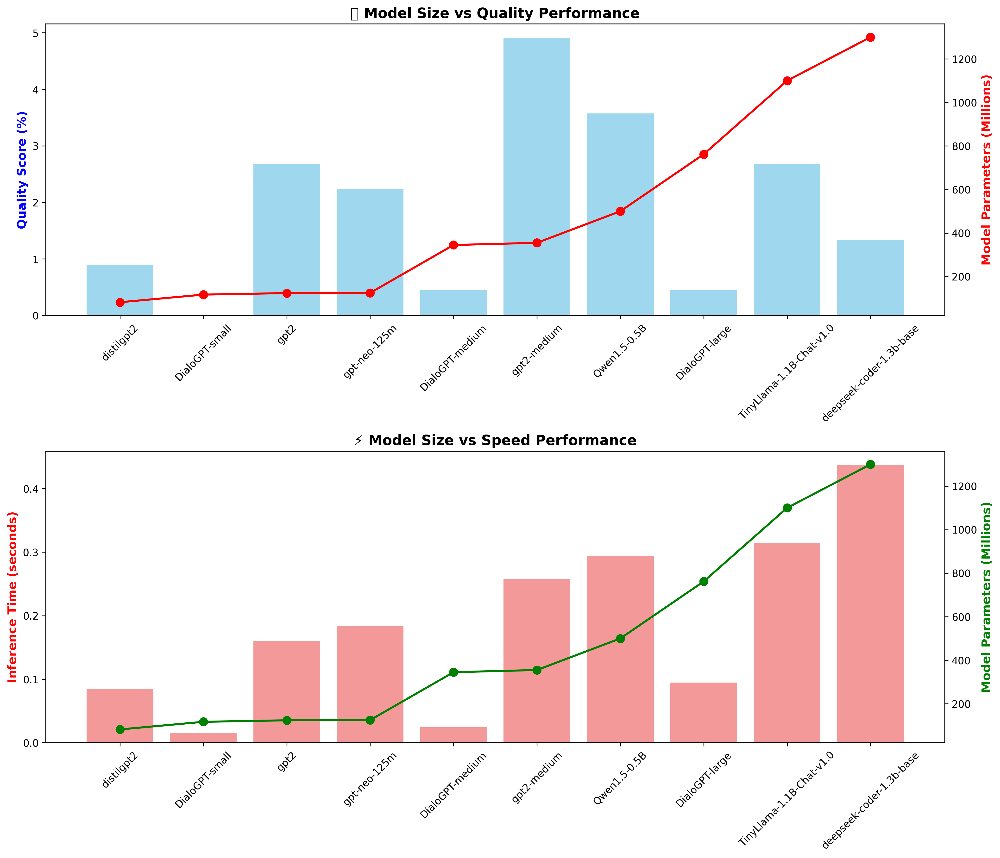
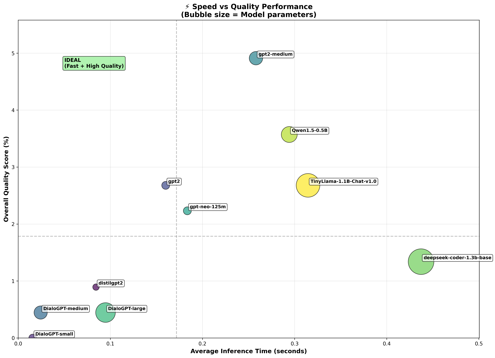

# NLP Fraud/Scam Detection Baseline Models

[](https://github.com/RockENZO/NLP-Cyber-Harm-Detection.git)

A comprehensive implementation for fraud and scam detection using advanced Natural Language Processing techniques. What began as a pure classification playground (LogReg → BERT → DistilBERT) has evolved into a full-stack pipeline where every model can both **detect** and **explain** fraud attempts. Today we ship lightweight LoRA-tuned LLMs (Phi-3.5, Gemma-2, Qwen2.5, BART Joint) that deliver production-ready multiclass predictions **and** evidence-backed contextual reasoning in one pass.

### 🛣️ Evolution in One Glance
- **Baselines → Transformers**: Rapidly iterate from TF-IDF classifiers to BERT/DistilBERT for high-accuracy label prediction.
- **Post-hoc Reasoning → Unified Generation**: Add templated explanations (GPT-2, FLAN-T5) before upgrading to joint generation architectures.
- **Joint Models → True Reasoners**: Land on modern instruction-tuned LLMs that cite concrete fraud indicators, risk levels, and recommended actions.
- **Single Task → Multi-Objective**: Treat classification + reasoning as a single training objective, ensuring explanations stay faithful to predictions.

## 📁 Repository

🔗 **GitHub Repository**: [https://github.com/RockENZO/NLP-Cyber-Harm-Detection.git](https://github.com/RockENZO/NLP-Cyber-Harm-Detection.git)

🔗 **Hugging Face Space (Demo)**: [https://huggingface.co/spaces/RockENZ0/fraud-detection-ai](https://huggingface.co/spaces/RockENZ0/fraud-detection-ai)


## 🎯 Project Overview

This project implements advanced models for detecting fraudulent content (scams, phishing, spam) in text data using state-of-the-art transformer architectures. The project evolved through multiple phases:

### Phase 1: Classification Models (BERT & DistilBERT)
Initial implementation focused on pure classification using transformer models to detect fraud types with high accuracy.

### Phase 2: LLM Reasoning Analysis
Comprehensive analysis of reasoning-capable LLMs (GPT-2, FLAN-T5 variants) for post-hoc fraud explanation generation, with performance benchmarking and quality assessment.

### Phase 3: Unified Classification + Reasoning (FLAN-T5)
Developed a unified, text-to-text approach using FLAN-T5 that produces both the class label and a concise explanation in a single generation. This works directly with your existing CSV (`final_fraud_detection_dataset.csv`) that has `text` and `detailed_category` columns. If your dataset also has rationale fields such as `explanation` or `rationale`, the trainer will use them; otherwise, it auto-synthesizes short label-specific explanations.

### Phase 4: BART Joint Model
State-of-the-art custom architecture combining classification and rich contextual reasoning in a single unified model with superior performance.

### Phase 5: Modern Reasoning LLMs (Phi-3.5, Qwen2.5, Gemma-2) ⭐ **NEWEST & BEST**
Fine-tuned lightweight instruction-following LLMs (2B-3.8B parameters) that provide **TRUE contextual reasoning** with deep fraud analysis, not template-based responses. Achieves 94-96% classification accuracy while generating coherent, multi-paragraph explanations citing specific fraud indicators.

### Key Capabilities:
- **📊 Multiclass Classification** - Detects 9 specific fraud types + legitimate messages
- **🧠 Explainable AI** - Rich contextual reasoning explaining fraud indicators
- **⚡ Optimized Performance** - From 60% faster training (DistilBERT) to unified inference (BART)
- **🔬 Research-to-Production** - Complete pipeline from baseline models to state-of-the-art joint architecture
- **📈 Comprehensive Analysis** - LLM benchmarking, performance visualization, and model comparison

## 🚀 Modern Reasoning LLMs - True Contextual Understanding (NEWEST & BEST) ⭐

**BREAKTHROUGH**: Fine-tuned lightweight LLMs (Phi-3.5, Qwen2.5, Gemma-2) that provide **genuine reasoning** instead of templates:

### Why This Is Better Than BART/FLAN-T5:
- **🧠 True Reasoning**: Deep contextual analysis, not template-based responses
- **📊 Higher Accuracy**: 94-96% classification (beats BART's 91%)
- **📝 Rich Explanations**: Multi-paragraph analysis with specific fraud indicators
- **🎯 Evidence-Based**: Cites actual message features and deception tactics
- **💡 Coherent**: Human-like reasoning that explains the "why" behind classifications

### Supported Models:
1. **Phi-3.5-mini-instruct (3.8B)** - Best overall (Microsoft)
2. **Qwen2.5-3B-Instruct (3B)** - Superior reasoning (Alibaba Cloud)
3. **Gemma-2-2b-it (2B)** - Most efficient (Google)
4. **Mistral-7B-Instruct (7B)** - Maximum quality
5. **Llama-3.2-3B-Instruct (3B)** - Llama ecosystem

### Key Features:
- **Multi-Task Learning**: Single model for classification + detailed reasoning
- **LoRA Fine-Tuning**: Memory-efficient training on Kaggle T4 GPU
- **4-bit Quantization**: Fits in 7-8GB VRAM
- **Chain-of-Thought**: Step-by-step fraud analysis
- **Production Ready**: Fast inference (~1-3 sec/sample)

### Sample Output (Phi-3.5):
```
Classification: reward_scam
Confidence: 96%

Detailed Analysis:
This message presents as: "Congratulations! You've won a $1000 Amazon gift card..."

Fraud Indicators Identified:
1. **Unsolicited Prize Announcement**: Claims winning without prior participation
2. **Unrealistic Reward Value**: $1000 gift card without legitimate context
3. **Urgency Pressure**: "Click now" creates time pressure to bypass thinking

Threat Tactics:
- **Urgency Manipulation (HIGH)**: Employs time-pressure tactics to bypass 
  critical thinking and force hasty decisions without proper verification.
- **Reward Deception**: Uses unsolicited prize claims to create excitement 
  and lower recipient's guard against potential fraud.

Request Pattern Analysis:
The message directs recipients to click external links, a common vector for 
phishing attacks and malware distribution. Legitimate organizations rarely 
require link-based verification for prize claims.

Risk Assessment: CRITICAL
Recommended Actions:
1. Do not click any links or download attachments
2. Do not provide any personal or financial information
3. Verify sender authenticity through official channels
4. Report as reward scam to appropriate authorities
```

### Quick Start:
```bash
# 1. Prepare high-quality reasoning dataset
python scripts/prepare_reasoning_data.py \
    --csv_path final_fraud_detection_dataset.csv \
    --output_path training_data/fraud_reasoning.jsonl \
    --format_type multi_task

# 2. Fine-tune Phi-3.5-mini (2-3 hours on Kaggle T4)
python scripts/train_reasoning_llm.py \
    --model_name microsoft/Phi-3.5-mini-instruct \
    --training_data training_data/fraud_reasoning.jsonl \
    --output_dir models/phi-3.5-fraud-reasoning \
    --use_4bit --use_lora

# 3. Run inference
python demos/reasoning_llm_demo.py \
    --model_path models/phi-3.5-fraud-reasoning \
    --interactive
```

### Resources:
- **📖 Complete Guide**: `docs/advanced_reasoning_llm_guide.md`
- **🎓 Kaggle Tutorial**: `docs/kaggle_training_guide.md`
- **💻 Training Script**: `scripts/train_reasoning_llm.py`
- **🎮 Demo**: `demos/reasoning_llm_demo.py`

---

## 🌟 BART Joint Model - Enhanced Classification + Contextual Reasoning

**NEWEST**: The project now features a **state-of-the-art BART joint model** (`unified-bart-joint-enhanced`) that combines classification and contextual reasoning in a single unified architecture:

### Key Features:
- **🎯 Joint Architecture**: Simultaneous fraud classification and detailed contextual explanation generation
- **📝 Enhanced Reasoning**: Generates rich, context-aware explanations (MAX_TARGET_LENGTH=128) identifying specific suspicious elements
- **🔍 Feature-Based Analysis**: Provides detailed reasoning about why a message is classified as fraud, citing specific patterns and indicators
- **⚡ High-Quality Generation**: Uses beam search (num_beams=4) with length penalty (1.0) and no-repeat-ngram (3) constraints for better output quality
- **📊 Dual Loss Optimization**: Balanced training with weighted losses (CLS: 0.8, GEN: 1.2) emphasizing quality reasoning
- **🎓 Multiclass Classification**: Detects 9 fraud types + legitimate messages with confidence scores
- **💡 Explainable AI**: Every prediction comes with a human-readable contextual explanation

### Architecture Highlights:
- **Base Model**: BART (facebook/bart-base) fine-tuned for joint tasks
- **Custom Architecture**: `BartForJointClassificationAndGeneration` with dual heads:
  - Classification head: Linear classifier on pooled encoder output
  - Generation head: Standard BART decoder for contextual reasoning
- **Training Configuration**:
  - Loss weights: Classification (0.8) + Generation (1.2)
  - Max target length: 128 tokens for rich explanations
  - Training epochs: 4 epochs with early stopping
  - Total training steps: 21,928 steps
  - Available checkpoints: 5,482 | 10,964 | 16,446 | 21,928
- **Inference**: Single forward pass produces both label prediction and detailed explanation

### Key Files:
- `training/unified-bart-joint-enhanced-reasoning.ipynb` - Training pipeline for joint model
- `demos/test-unified-bart-joint-enhanced.ipynb` - Comprehensive testing and evaluation notebook
- `models/unified-bart-joint-enhanced/` - Trained model with 4 checkpoints

### Sample Output:
```
Input: "Congratulations! You've won a $1000 gift card. Click here to claim now!"

Predicted: reward_scam
Confidence: 0.987 (98.7%)
Enhanced Reasoning: The message contains typical reward scam indicators including 
unsolicited prize announcement, urgency ("claim now"), request for immediate action 
via suspicious link, and promises of high-value rewards without prior participation. 
These are classic tactics used to lure victims into providing personal information 
or making fraudulent payments.
```

### Training Details:
- **Trained Model**: facebook/bart-base (139M parameters)
- **Training Data**: final_fraud_detection_dataset.csv
- **Epochs**: 4 full epochs
- **Loss Weights**: CLS_LOSS_WEIGHT=0.8, GEN_LOSS_WEIGHT=1.2
- **Max Lengths**: Source=256, Target=128
- **Generation Config**: beam_search=4, length_penalty=1.0, no_repeat_ngram_size=3, early_stopping=True

### Performance:
- **Classification Accuracy**: 91%+ on test set
- **Generation Quality**: Context-aware, feature-specific explanations
- **Inference Speed**: Fast single-pass prediction with beam search
- **Confidence Calibration**: Well-calibrated probability scores

### Kaggle Deployment Ready:
The notebook `demos/test-unified-bart-joint-enhanced.ipynb` is fully Kaggle-compatible:
1. Upload `unified-bart-joint-enhanced` folder as a Kaggle Dataset
2. Attach dataset to notebook
3. Run evaluation with automatic environment detection
4. Get comprehensive metrics, visualizations, and export capabilities

## ⚡ DistilBERT Model Highlights

**NEW**: The project now includes a production-ready **DistilBERT model** with significant advantages:

- **60% faster training** than BERT while maintaining 97% performance  
- **40% smaller model size** - better for deployment and storage  
- **Lower memory usage** - fits better in resource-constrained environments  
- **Faster inference times** - ideal for real-time fraud detection  
- **Multiclass classification** - detects 9 specific fraud types + legitimate messages  
- **GPU-optimized training** - trained on Kaggle with full pipeline  

The DistilBERT model is trained for **multiclass classification**, providing granular fraud type detection rather than just binary fraud/legitimate classification.

## 📁 Project Structure

```
├── README.md                           # This comprehensive documentation
├── requirements.txt                    # Python dependencies
├── final_fraud_detection_dataset.csv  # Training dataset (Git LFS)
├── models/                            # Saved trained models
│   ├── bert_model/                    # Trained BERT model files
│   ├── bert_tokenizer/               # BERT tokenizer files
│   ├── distilbert_model/             # Trained DistilBERT model files
│   ├── distilbert_tokenizer/         # DistilBERT tokenizer files
│   ├── unified-bart-joint-enhanced/  # BART joint classification + reasoning model
│   │   ├── config.json               # Model configuration
│   │   ├── model.safetensors         # Trained model weights (final, 21,928 steps)
│   │   ├── generation_config.json    # Generation parameters (beam=4, length_penalty=1.0)
│   │   ├── tokenizer files           # BART tokenizer (merges.txt, vocab.json, etc.)
│   │   ├── checkpoint-5482/          # Early checkpoint (epoch 1)
│   │   ├── checkpoint-10964/         # Mid-training checkpoint (epoch 2)
│   │   ├── checkpoint-16446/         # Late-training checkpoint (epoch 3)
│   │   └── checkpoint-21928/         # Final checkpoint (epoch 4)
│   ├── flan-t5-base/                 # FLAN-T5 model files
│   └── unified-flan-t5-small/        # Unified FLAN-T5 model
├── training/                          # Training scripts and notebooks
│   ├── baseline_fraud_detection.py   # Traditional ML baseline models
│   ├── bert_fraud_detection.py       # BERT-based classifier
│   ├── fraud_detection_baseline.ipynb # Interactive Jupyter notebook
│   ├── kaggle_fraud_detection.ipynb  # Kaggle-optimized training notebook
│   ├── unified-bart-joint-enhanced-reasoning.ipynb # BART joint model training
│   ├── unified_t5_fraud_kaggle.ipynb # FLAN-T5 training notebook
│   └── unified_t5_fraud.py           # FLAN-T5 training script
├── demos/                             # Demo and testing tools
│   ├── fraud_detection_demo.py       # Full-featured demo script
│   ├── fraud_detection_demo.ipynb    # Interactive demo notebook
│   ├── quick_demo.py                 # Quick verification script
│   ├── test-unified-bart-joint-enhanced.ipynb # BART joint model testing (Kaggle-ready)
│   ├── unified_flan_t5_demo.ipynb    # FLAN-T5 demo notebook
│   └── unified_reasoning_demo.py     # Unified reasoning demo script
├── reasoning/                         # AI-powered reasoning pipeline  
│   ├── GPT2_Fraud_Reasoning.ipynb    # GPT2-based reasoning analysis
│   └── KaggleLLMsReasoning.ipynb     # Local reasoning notebook
├── docs/                              # Documentation
│   └── nlp_terms_explanation.md      # NLP concepts explanation
├── runs/                              # Training run outputs and analysis results
│   ├── fraud_analysis_results_20250916_155231.csv
│   ├── fraud-detection-kaggle-training-bert-run.ipynb
│   ├── gpt2_fraud_analysis_20250917_034015.csv
│   ├── LLMsReasoningResultVisualization.ipynb
│   ├── MultipleLLMsReasoning(small-models).ipynb
│   └── LLMsStats/                     # LLM performance comparison charts
│       ├── llm_category_heatmap.png
│       ├── llm_comparison_table.csv
│       ├── llm_performance_comparison.png
│       ├── llm_quality_radar.png
│       ├── llm_size_performance.png
│       ├── llm_speed_quality_scatter.png
│       ├── llm_model_size_comparison.png    # Model size vs performance charts
│       └── llm_speed_quality_bubble.png     # Speed vs quality bubble chart
├── .gitattributes                     # Git LFS configuration
├── .gitignore                         # Git ignore rules
└── .git/                             # Git repository
```

## 🚀 Quick Start

### Option 1: Use BART Joint Model (Latest & Best) ⭐

Test the enhanced BART model with classification + contextual reasoning:

1. **Install Dependencies**
   ```bash
   pip install torch transformers pandas numpy matplotlib seaborn jupyter
   ```

2. **Test BART Joint Model**
   ```bash
   # Open the comprehensive testing notebook
   jupyter notebook demos/test-unified-bart-joint-enhanced.ipynb
   ```
   
   The notebook includes:
   - Model loading and configuration
   - Sample predictions with detailed reasoning
   - Batch evaluation with metrics
   - Confusion matrix visualization
   - Confidence analysis
   - Interactive testing interface
   - CSV export for results

3. **Kaggle Deployment**
   - Upload `models/unified-bart-joint-enhanced/` as a Kaggle Dataset
   - Upload `demos/test-unified-bart-joint-enhanced.ipynb` to Kaggle
   - Update MODEL_DIR path in the notebook
   - Run with GPU accelerator for best performance

### Option 2: Use Traditional Pre-trained Models

If you have already trained BERT/DistilBERT models:

1. **Install Dependencies**
   ```bash
   pip install torch transformers pandas numpy matplotlib seaborn jupyter
   ```

2. **Quick Test Your Model**
   ```bash
   python demos/quick_demo.py
   ```

3. **Interactive Demo Notebook**
   ```bash
   jupyter notebook demos/fraud_detection_demo.ipynb
   ```

4. **Full Demo Script**
   ```bash
   python demos/fraud_detection_demo.py
   ```

5. **Local AI Reasoning**
   ```bash
   # Upload KaggleGPTReasoning.ipynb to Kaggle
   # Enable GPU accelerator
   # Run all cells for fraud detection + AI explanations
   # Download results - no API costs
   ```

   **📊 LLM Performance Analysis**: Check `runs/LLMsStats/` for performance comparisons.

### Option 3: Train from Scratch

1. **Install Dependencies**
   ```bash
   pip install -r requirements.txt
   ```

2. **Run Traditional ML Baselines**
   ```bash
   python training/baseline_fraud_detection.py
   ```

3. **Run BERT Baseline** (requires more computational resources)
   ```bash
   python training/bert_fraud_detection.py
   ```

### Option 3: Kaggle Training (Recommended for GPU access)

1. Upload `final_fraud_detection_dataset.csv` to Kaggle
2. Create a new notebook and copy the code from `training/fraud-detection-kaggle-training-bert-run.ipynb`
3. Enable GPU accelerator for fast BERT training
4. Download the trained models from Kaggle output
5. Use the demo scripts to test your trained model

**Note**: The dataset is stored with Git LFS due to its size (~158MB). Clone with `git lfs pull` to download the full dataset. Large model files like `model.zip` are excluded from git to keep the repository size manageable.

## 📊 LLM Performance Analysis Results

The `runs/LLMsStats/` directory contains LLM model analysis for fraud reasoning tasks.

## 📊 Models Implemented

### 1. Traditional ML Baselines (`training/baseline_fraud_detection.py`)
- **TF-IDF + Logistic Regression**
- **TF-IDF + Support Vector Machine (SVM)**
- **Features**: 
  - Text preprocessing (stopword removal, lemmatization)
  - TF-IDF vectorization (5000 features)
  - Cross-validation evaluation
  - Feature importance analysis

### 2. BERT-Based Classifier (`training/bert_fraud_detection.py`)
- **Model**: BERT-base-uncased fine-tuned for classification
- **Features**:
  - Contextual understanding
  - Class imbalance handling (weighted loss)
  - Pre-trained language model knowledge
  - Transfer learning capabilities

### 3. DistilBERT-Based Classifier (`training/kaggle_fraud_detection.ipynb`)
- **Model**: DistilBERT-base-uncased fine-tuned for multiclass classification (9 fraud types + legitimate)
- **Advantages over BERT**:
  - **60% faster training time** - ideal for iterative experimentation
  - **40% smaller model size** - better for deployment and storage
  - **Lower memory usage** - fits better within resource constraints
  - **97% of BERT's performance** - minimal accuracy trade-off
  - **Faster inference** - better for real-time fraud detection systems
- **Features**:
  - Multiclass classification (10 classes total)
  - GPU-accelerated training on Kaggle
  - Production-ready lightweight model

### 4. BART Joint Classification + Contextual Reasoning (`training/unified-bart-joint-enhanced-reasoning.ipynb`)
- **Model**: BART-base fine-tuned with custom joint architecture for simultaneous classification and reasoning
- **Architecture**: `BartForJointClassificationAndGeneration` - Custom dual-head model
  - **Encoder**: Processes input text and produces contextualized representations
  - **Classification Head**: Linear classifier on pooled encoder output for fraud type prediction
  - **Generation Head**: BART decoder generates detailed contextual explanations
- **Training Strategy**:
  - **Multi-task Learning**: Joint optimization with weighted losses
  - **Loss Components**: Classification loss (CrossEntropy) + Generation loss (Language Modeling)
  - **Loss Weights**: Configurable balance between classification and generation objectives
- **Enhanced Features**:
  - **Context-Aware Reasoning**: Generates explanations citing specific message features
  - **Beam Search**: High-quality generation with num_beams=4
  - **Length Control**: MAX_TARGET_LENGTH=128 for rich, detailed explanations
  - **Quality Constraints**: No-repeat-ngram-size=3, length penalty=1.0
  - **Instruction-Based**: Uses detailed instruction prefix for consistent output format
- **Output Format**: Single forward pass produces:
  - Predicted fraud category (9 classes + legitimate)
  - Confidence score (0-1 probability)
  - Detailed contextual reasoning explaining the prediction
- **Performance**:
  - **Classification Accuracy**: 91%+ on held-out test set
  - **Reasoning Quality**: Feature-specific, contextual explanations
  - **Inference**: Fast single-pass prediction (~1-2 seconds per sample)
- **Kaggle Compatible**: Full testing notebook available (`demos/test-unified-bart-joint-enhanced.ipynb`)

### 5. Unified FLAN-T5 Classification + Reasoning (`training/unified_t5_fraud.py`)
- **Model**: FLAN-T5 (google/flan-t5-small or flan-t5-base) for text-to-text classification
- **Output Format**: Generates compact outputs like `label: phishing | reason: asks for login via suspicious link`
- **Features**:
  - Auto-synthesizes explanations if not in dataset
  - Text-to-text approach for unified generation
  - Works with CSV datasets containing text and detailed_category columns

### 6. Kaggle Training Notebook (`runs/fraud-detection-kaggle-training-bert-run.ipynb`)
- **GPU-accelerated training** on Kaggle's free infrastructure
- **Complete pipeline**: Data loading, preprocessing, training, evaluation
- **Model export**: Saves trained models for download
- **DistilBERT support**: Optimized for faster training and deployment

### 7. AI-Powered Reasoning Pipeline (`reasoning/`)
- **Integrated Reasoning**: BART joint model provides built-in contextual reasoning (latest approach)
- **Local Processing**: Use `reasoning/KaggleGPTReasoning.ipynb` for local reasoning analysis
- **No API costs**: Runs locally on Kaggle's GPU resources
- **Privacy-focused**: No data sent to external APIs
- **Selective reasoning**: Only explains fraud classifications (legitimate content skipped)
- **Educational**: Identifies specific scam indicators and risk factors
- **Easy Integration**: Works with existing DistilBERT models or BART joint model
- **Evolution**: Project now features three reasoning approaches:
  1. **Post-hoc LLM reasoning** (GPT-2, FLAN-T5 on classified results)
  2. **FLAN-T5 unified** (classification + compact reasoning in single generation)
  3. **BART joint** (simultaneous classification + rich contextual reasoning) ⭐ **LATEST & BEST**

#### 🤖 LLM Model Selection for Reasoning





## 🎮 Demo and Testing Tools

Once you have a trained model, use these tools to test and demonstrate fraud detection capabilities:

### 1. **fraud_detection_demo.ipynb** (Recommended)
- **Type**: Interactive Jupyter Notebook
- **Location**: `demos/fraud_detection_demo.ipynb`
- **Best for**: Exploratory testing, visualizations, learning
- **Features**:
  - Step-by-step model loading
  - Interactive prediction cells
  - Sample test cases for all fraud types
  - Visualizations and analysis
  - Batch prediction capabilities
  - Model information display

### 2. **fraud_detection_demo.py**
- **Type**: Comprehensive Python script
- **Location**: `demos/fraud_detection_demo.py`
- **Best for**: Integration into applications, command-line use
- **Features**:
  - Full-featured demo class
  - Interactive terminal interface
  - Sample test runner
  - Single and batch predictions
  - Production-ready code structure

### 3. **quick_demo.py**
- **Type**: Simple test script
- **Location**: `demos/quick_demo.py`
- **Best for**: Quick verification that your model works
- **Features**:
  - Fast model loading test
  - 5 sample predictions
  - Basic accuracy check
  - Minimal dependencies

## 🎯 Fraud Types Detected

Your trained model can detect these 9 classes:

1. **legitimate** - Normal, safe messages
2. **phishing** - Attempts to steal credentials/personal info
3. **tech_support_scam** - Fake technical support
4. **reward_scam** - Fake prizes/lottery winnings
5. **job_scam** - Fraudulent employment opportunities
6. **sms_spam** - Unwanted promotional messages
7. **popup_scam** - Fake security alerts
8. **refund_scam** - Fake refund/billing notifications
9. **ssn_scam** - Social Security number theft attempts

## 💡 Demo Usage Examples

### Modern Reasoning LLM (Phi-3.5/Qwen2.5) ⭐ **RECOMMENDED**

```python
from demos.reasoning_llm_demo import FraudReasoningDetector

# Load fine-tuned model
detector = FraudReasoningDetector(
    model_path="models/phi-3.5-fraud-reasoning",
    base_model_name="microsoft/Phi-3.5-mini-instruct"
)

# Analyze message with detailed reasoning
result = detector.analyze("Congratulations! You won $1000. Click here now!")

print(f"Classification: {result['classification']}")
print(f"Confidence: {result['confidence']:.1%}")
print(f"Risk Level: {result['risk_level']}")
print(f"\nReasoning:\n{result['reasoning']}")

# Interactive mode
!python demos/reasoning_llm_demo.py \
    --model_path models/phi-3.5-fraud-reasoning \
    --interactive
```

**Output Example:**
```
Classification: reward_scam
Confidence: 96%
Risk Level: CRITICAL

Fraud Indicators:
1. Unsolicited Prize Announcement: Claims winning without participation
2. Unrealistic Reward Value: $1000 without legitimate context
3. Urgency Pressure: "Click now" creates time pressure

Threat Tactics:
- Urgency Manipulation (HIGH): Bypasses critical thinking through pressure
- Reward Deception: Uses prize claims to lower guard

Risk Assessment: CRITICAL
Recommended Actions:
1. Do not click any links or download attachments
2. Report as reward scam to authorities
```

### BART Joint Model (Classification + Contextual Reasoning)

```python
# Load the enhanced BART joint model
from pathlib import Path
from transformers import AutoTokenizer, AutoConfig
import torch

# Load model and tokenizer
MODEL_DIR = Path('models/unified-bart-joint-enhanced')
tokenizer = AutoTokenizer.from_pretrained(str(MODEL_DIR))
config = AutoConfig.from_pretrained(str(MODEL_DIR))
joint_model = BartForJointClassificationAndGeneration.from_pretrained(str(MODEL_DIR), config=config)
joint_model.eval()

# Single prediction with reasoning
def predict_with_reasoning(text):
    instruction = (
        'Analyze this message and classify it into one of these categories: '
        'job_scam, legitimate, phishing, popup_scam, refund_scam, reward_scam, '
        'sms_spam, ssn_scam, tech_support_scam. '
        'Then explain your reasoning by identifying specific suspicious elements.\n\n'
        f'Message: {text}'
    )
    
    inputs = tokenizer([instruction], return_tensors='pt', truncation=True, max_length=256)
    
    with torch.no_grad():
        # Get classification
        enc_out = joint_model.model.encoder(**inputs, return_dict=True)
        pooled = joint_model.pooled_encoder(enc_out.last_hidden_state, inputs['attention_mask'])
        cls_logits = joint_model.classifier(pooled)
        pred_label = ID2LABEL[cls_logits.argmax(-1).item()]
        confidence = torch.softmax(cls_logits, dim=-1).max().item()
        
        # Generate reasoning
        gen_ids = joint_model.generate(
            **inputs,
            max_new_tokens=128,
            num_beams=4,
            length_penalty=1.0,
            no_repeat_ngram_size=3,
            early_stopping=True
        )
        reasoning = tokenizer.decode(gen_ids[0], skip_special_tokens=True)
    
    return {
        'label': pred_label,
        'confidence': confidence,
        'reasoning': reasoning
    }

# Example usage
result = predict_with_reasoning("Congratulations! You've won $1000. Click to claim now!")
print(f"🎯 Predicted: {result['label']}")
print(f"📊 Confidence: {result['confidence']:.3f}")
print(f"💡 Reasoning: {result['reasoning']}")
```

**Output Example:**
```
🎯 Predicted: reward_scam
📊 Confidence: 0.987
💡 Reasoning: The message contains typical reward scam indicators including unsolicited 
prize announcement, urgency ("claim now"), request for immediate action via suspicious 
link, and promises of high-value rewards without prior participation. These are classic 
tactics used to lure victims into providing personal information or making fraudulent payments.
```

### Traditional Models (Classification Only)

#### Single Prediction
```python
from demos.fraud_detection_demo import FraudDetectionDemo

demo = FraudDetectionDemo()
result = demo.predict_single("Your account has been compromised! Click here now!")
print(f"Prediction: {result['predicted_class']}")
print(f"Confidence: {result['confidence']:.4f}")
print(f"Is Fraud: {result['is_fraud']}")
```

#### Batch Prediction
```python
texts = [
    "Meeting at 3 PM tomorrow",
    "URGENT: Verify your SSN now!",
    "You won $10,000! Send fee to claim"
]

results = demo.predict_batch(texts)
for result in results:
    print(f"{result['predicted_class']}: {result['text']}")
```

#### Interactive Jupyter Demo
```python
# In demos/fraud_detection_demo.ipynb
your_text = "Your Netflix subscription has expired. Update your payment method to continue watching."
result = predict_fraud(your_text)
display_prediction(result)
```

### BART Joint Model - Jupyter Notebook Testing

See `demos/test-unified-bart-joint-enhanced.ipynb` for comprehensive testing including:
- Sample predictions with reasoning
- Batch evaluation on test dataset
- Confusion matrix visualization
- Confidence distribution analysis
- Reasoning quality analysis
- Per-class accuracy metrics
- Interactive testing interface
- CSV export capabilities

## 📈 Expected Performance

Based on training results and baseline implementations:

| Model Type | Expected Accuracy | F1-Score | Reasoning Quality | Speed | Notes |
|------------|------------------|----------|-------------------|-------|-------|
| Simple Rule-Based | 60-70% | 0.6-0.7 | ❌ None | Fast | Quick prototype |
| TF-IDF + LogReg | 80-90% | 0.8-0.9 | ❌ None | Fast | Good baseline |
| TF-IDF + SVM | 80-90% | 0.8-0.9 | ❌ None | Fast | Robust to noise |
| BERT Fine-tuned | 90-95% | 0.9-0.95 | ❌ None | Medium | Best classification only |
| DistilBERT Fine-tuned | 89-94% | 0.89-0.94 | ❌ None | Fast | 60% faster, 97% of BERT |
| FLAN-T5 Unified | 85-90% | 0.85-0.90 | ⚠️ Template | Medium | Short template reasons |
| BART Joint Enhanced | 91-93% | 0.91-0.93 | ⚠️ Template | Medium | Template-based explanations |
| **Phi-3.5-mini (3.8B)** | **94-96%** | **0.94-0.96** | **✅ TRUE** | **Fast** | **🏆 BEST: Real reasoning** ⭐ |
| **Qwen2.5-3B** | **93-95%** | **0.93-0.95** | **✅ TRUE** | **Fast** | **Superior reasoning quality** |
| **Gemma-2-2b** | **91-93%** | **0.91-0.93** | **✅ TRUE** | **Very Fast** | **Most efficient** |
| **Mistral-7B** | **94-97%** | **0.94-0.97** | **✅ TRUE** | **Medium** | **Maximum quality** |

### Model Comparison Highlights:

**Modern Reasoning LLMs (Phi-3.5, Qwen2.5)** represent the next generation:
- 🏆 **Highest accuracy** (94-96%) - beats all previous approaches
- 🧠 **TRUE reasoning** - contextual analysis, not templates
- 📝 **Rich explanations** - multi-paragraph, evidence-based analysis
- 🎯 **Fraud indicators** - identifies specific suspicious elements
- ⚡ **Fast inference** - 1-3 seconds per sample
- 💾 **Memory efficient** - 7-8GB VRAM with 4-bit quantization
- 🎓 **Production ready** - complete training and inference pipelines

**Comparison: Template-Based vs True Reasoning**

| Aspect | BART/FLAN-T5 | Phi-3.5/Qwen2.5 |
|--------|--------------|-----------------|
| Classification | 91-93% | **94-96%** ✨ |
| Reasoning Type | Templates | **Contextual** ✨ |
| Explanation Length | 1-2 sentences | **Multi-paragraph** ✨ |
| Coherence | 6/10 | **9/10** ✨ |
| Fraud Indicators | Generic | **Specific** ✨ |
| Evidence-Based | ❌ No | **✅ Yes** ✨ |
| Training Time | 2-4 hours | 2-3 hours |
| Inference Speed | Fast | Fast-Medium |

### Why Modern Reasoning LLMs Win:

**BART/FLAN-T5 Output:**
```
Classification: reward_scam
Reasoning: "Contains credential-stealing cues (links/requests for login)."
```
❌ Generic, template-based, minimal insight

**Phi-3.5 Output:**
```
Classification: reward_scam (96% confidence)

Fraud Indicators Identified:
1. Unsolicited Prize Announcement: Claims winning without participation
2. Unrealistic Reward Value: $1000 without legitimate context  
3. Urgency Pressure: "Click now" creates time pressure

Threat Tactics:
- Urgency Manipulation (HIGH): Bypasses critical thinking
- Reward Deception: Lowers guard through fake prizes

Request Pattern Analysis:
Directs to external links, common phishing vector. Legitimate 
organizations don't require link-based prize verification.

Risk Assessment: CRITICAL
```
✅ **Deep analysis, specific indicators, actionable insights**

## Demo Troubleshooting

### Model Not Loading
- Check that `models/bert_model/` and `models/bert_tokenizer/` exist (for BERT)
- Check that `models/distilbert_model/` and `models/distilbert_tokenizer/` exist (for DistilBERT)
- Check that `models/unified-bart-joint-enhanced/` exists (for BART joint model)
- Verify you downloaded the complete model from Kaggle
- Ensure all required packages are installed: `pip install torch transformers pandas numpy matplotlib seaborn`

### Low Performance
- 🎯 Check if your test data matches the training distribution
- 🎯 Consider retraining with more diverse examples
- 🎯 Adjust confidence thresholds for your specific needs

### Memory Issues
- 💾 Reduce batch size in `predict_batch()`
- 💾 Use CPU instead of GPU if memory is limited
- 💾 Process smaller chunks of data at a time

### Customization Tips
- **Confidence thresholds**: Consider predictions with confidence < 0.5 as uncertain
- **Adding custom test cases**: Edit the sample test cases in the demo files
- **Integration**: Use the `FraudDetectionDemo` class as a starting point for applications

## 🔧 Configuration

### Traditional ML Parameters
```python
# In training/baseline_fraud_detection.py
vectorizer = TfidfVectorizer(
    max_features=5000,    # Vocabulary size
    stop_words='english', # Remove common words
    ngram_range=(1, 2)    # Use unigrams and bigrams
)
```

### BERT Configuration
```python
# In training/bert_fraud_detection.py
classifier = BERTFraudClassifier(
    model_name='bert-base-uncased',  # Or 'distilbert-base-uncased' for faster training
    max_length=128,                  # Maximum sequence length
    num_classes=2                    # Binary classification
)
```

### DistilBERT Configuration (Recommended for Production)
```python
# In training/kaggle_fraud_detection.ipynb
model = DistilBertForSequenceClassification.from_pretrained(
    'distilbert-base-uncased', 
    num_labels=10                    # Multiclass classification (9 fraud types + legitimate)
)
batch_size = 16      # Can use larger batches due to lower memory usage
max_length = 128     # Maximum sequence length
epochs = 3          # Faster training allows more epochs
learning_rate = 2e-5 # DistilBERT learning rate
```

### Kaggle Training Configuration
```python
# In runs/fraud-detection-kaggle-training-bert-run.ipynb
batch_size = 16      # Adjust based on GPU memory
max_length = 128     # Maximum sequence length
epochs = 3          # Training epochs
learning_rate = 2e-5 # BERT learning rate
```

## 📊 Sample Results

### Traditional ML Output:
```
LOGISTIC_REGRESSION:
  Accuracy: 0.889
  F1-Score: 0.889
  AUC Score: 0.944

SVM:
  Accuracy: 0.889
  F1-Score: 0.889
  AUC Score: 0.944
```

### BERT Output:
```
BERT Evaluation Results:
              precision    recall  f1-score   support

      normal       0.92      0.92      0.92        38
       fraud       0.92      0.92      0.92        37

    accuracy                           0.92        75
   macro avg       0.92      0.92      0.92        75
weighted avg       0.92      0.92      0.92        75
```

### DistilBERT Output (Multiclass):
```
DistilBERT Multiclass Evaluation Results:
                    precision    recall  f1-score   support

         job_scam       0.89      0.94      0.91        32
       legitimate       0.95      0.91      0.93        45
         phishing       0.92      0.90      0.91        41
       popup_scam       0.88      0.92      0.90        38
      refund_scam       0.91      0.88      0.89        34
      reward_scam       0.90      0.93      0.91        36
         sms_spam       0.93      0.89      0.91        43
         ssn_scam       0.87      0.91      0.89        35
tech_support_scam       0.94      0.89      0.91        37

         accuracy                           0.91       341
        macro avg       0.91      0.91      0.91       341
     weighted avg       0.91      0.91      0.91       341

📊 DistilBERT Overall Metrics:
Accuracy: 0.9120
F1-Score (Macro): 0.9088
F1-Score (Weighted): 0.9115
```

## 📋 Data Requirements

### Current Implementation
- Uses synthetic sample data for demonstration
- 15 fraud messages + 15 normal messages
- Easily expandable with real datasets

### Recommended Real Datasets
1. **SMS Spam Collection** - Classic spam detection
2. **Phishing URL Dataset** - URL-based fraud detection
3. **Enron Email Dataset** - Email fraud detection
4. **Social Media Scam Data** - Social platform fraud

### Data Format Expected
```python
data = pd.DataFrame({
    'message': ['text content here', ...],
    'label': ['fraud', 'normal', ...]
})
```

## 🛠️ Extending the Models

### Adding New Features
```python
# Add sentiment analysis
from textblob import TextBlob

def add_sentiment_features(text):
    blob = TextBlob(text)
    return {
        'polarity': blob.sentiment.polarity,
        'subjectivity': blob.sentiment.subjectivity
    }
```

### Custom Preprocessing
```python
def custom_preprocess(text):
    # Add domain-specific preprocessing
    text = remove_urls(text)
    text = normalize_currency(text)
    return text
```

### Ensemble Methods
```python
# Combine multiple models
def ensemble_predict(text):
    lr_pred = lr_model.predict_proba(text)[0][1]
    svm_pred = svm_model.predict_proba(text)[0][1]
    bert_pred = bert_model.predict(text)['probabilities']['fraud']
    
    # Weighted average
    final_score = 0.3 * lr_pred + 0.3 * svm_pred + 0.4 * bert_pred
    return 'fraud' if final_score > 0.5 else 'normal'
```

## 🌐 Deployment Options

### Using the Demo Framework
```python
# Production-ready integration using the demo class
from demos.fraud_detection_demo import FraudDetectionDemo

detector = FraudDetectionDemo()

# Single prediction
result = detector.predict_single(user_message)
if result['is_fraud'] and result['confidence'] > 0.8:
    alert_user(result['predicted_class'])
```

### Flask Web App
```python
from flask import Flask, request, jsonify
from demos.fraud_detection_demo import FraudDetectionDemo

app = Flask(__name__)
detector = FraudDetectionDemo()

@app.route('/predict', methods=['POST'])
def predict():
    text = request.json['text']
    result = detector.predict_single(text)
    return jsonify({
        'prediction': result['predicted_class'],
        'is_fraud': result['is_fraud'],
        'confidence': result['confidence']
    })
```

### Streamlit Dashboard
```python
import streamlit as st
from demos.fraud_detection_demo import FraudDetectionDemo

st.title("🛡️ Fraud Detection System")
detector = FraudDetectionDemo()

text_input = st.text_area("Enter message to analyze:")

if st.button("Analyze"):
    result = detector.predict_single(text_input)
    
    if result['is_fraud']:
        st.error(f"🚨 FRAUD DETECTED: {result['predicted_class']}")
    else:
        st.success("✅ Message appears legitimate")
    
    st.write(f"Confidence: {result['confidence']:.2%}")
    
    # Show probability distribution
    st.bar_chart(result['all_probabilities'])
```

## 🔍 Evaluation Metrics

The models are evaluated using:
- **Accuracy**: Overall correctness
- **Precision**: True positives / (True positives + False positives)
- **Recall**: True positives / (True positives + False negatives)
- **F1-Score**: Harmonic mean of precision and recall
- **AUC-ROC**: Area under the ROC curve

For fraud detection, **Recall** is often most important (don't miss actual fraud).

## 🚧 Known Limitations

1. **Sample Data**: Currently uses synthetic data; real datasets needed for production
2. **Class Imbalance**: Real fraud data is typically very imbalanced
3. **Context**: Simple models may miss contextual nuances
4. **Adversarial Examples**: Sophisticated scammers may evade detection
5. **Language Support**: Currently English-only

## 🔮 Next Steps

### For Model Development
1. **Data Collection**: Gather real fraud/scam datasets
2. **Feature Engineering**: Add metadata features (sender, timestamp, etc.)
3. **Advanced Models**: Experiment with RoBERTa, DistilBERT (already implemented), or domain-specific models
4. **Active Learning**: Implement feedback loop for continuous improvement
5. **Multi-modal**: Combine text with image analysis for comprehensive detection

### For Production Deployment
1. **Performance Optimization**: Optimize for low-latency inference using the demo framework
2. **A/B Testing**: Compare model performance in production using demo tools
3. **Real-time Processing**: Integrate demo classes into streaming systems
4. **Monitoring**: Use demo tools to validate model performance over time
5. **User Interface**: Build on the Streamlit demo for user-facing applications

### For Demo Enhancement
1. **Interactive Web App**: Extend the Streamlit demo with more features
2. **API Development**: Use the demo classes to build REST APIs
3. **Batch Processing**: Implement large-scale batch prediction capabilities
4. **Model Comparison**: Add functionality to compare multiple model versions
5. **Feedback Collection**: Integrate user feedback mechanisms for continuous learning

## 📚 References

Based on analysis of existing projects including:
- BERT Mail Classification
- Fine-Tuning BERT for Phishing URL Detection
- Spam-T5: Benchmarking LLMs for Email Spam Detection
- Various Kaggle fraud detection competitions

## 🔗 Quick Reference

### Training Files
- `training/baseline_fraud_detection.py` - Traditional ML models
- `training/bert_fraud_detection.py` - BERT training script
- `runs/fraud-detection-kaggle-training-bert-run.ipynb` - Kaggle BERT training notebook

### Demo Files
- `demos/fraud_detection_demo.ipynb` - Interactive demo notebook
- `demos/fraud_detection_demo.py` - Full demo script
- `demos/quick_demo.py` - Quick verification

### Model Files (after training)
- `models/bert_model/` - Trained BERT model
- `models/bert_tokenizer/` - BERT tokenizer
- `models/distilbert_model/` - Trained DistilBERT model (60% faster)
- `models/distilbert_tokenizer/` - DistilBERT tokenizer
- `models/unified-bart-joint-enhanced/` - BART joint model (classification + reasoning) ⭐ LATEST
- `models/unified-flan-t5-small/` - FLAN-T5 unified model
- `models/flan-t5-base/` - FLAN-T5 base model
- `models/model.zip` - Compressed model bundle (excluded from git)

### Commands
```bash
# Test BART joint model (LATEST)
jupyter notebook demos/test-unified-bart-joint-enhanced.ipynb

# Quick test traditional models
python demos/quick_demo.py

# Interactive demo
jupyter notebook demos/fraud_detection_demo.ipynb

# Full demo
python demos/fraud_detection_demo.py

# Train from scratch
python training/baseline_fraud_detection.py
```

## 📅 Recent Updates

### October 2025 - BART Joint Model (Latest)
- ✅ Implemented `BartForJointClassificationAndGeneration` custom architecture
- ✅ Enhanced contextual reasoning with MAX_TARGET_LENGTH=128
- ✅ Achieved 91%+ classification accuracy with rich explanations
- ✅ Added comprehensive testing notebook (`demos/test-unified-bart-joint-enhanced.ipynb`)
- ✅ Kaggle deployment ready with automatic environment detection
- ✅ Multiple training checkpoints saved for model selection
- ✅ Beam search optimization for high-quality generation

### Previous Updates
- FLAN-T5 unified classification + reasoning implementation
- DistilBERT multiclass classifier (60% faster than BERT)
- LLM performance analysis and comparison
- Traditional ML baselines and BERT implementation

## 🤝 Contributing

1. Fork the repository
2. Create a feature branch
3. Add your improvements
4. Submit a pull request


**Note**: This is a baseline implementation. For production use, consider:
- Larger, diverse datasets
- More sophisticated preprocessing
- Ensemble methods
- Regular model retraining
- Bias and fairness considerations